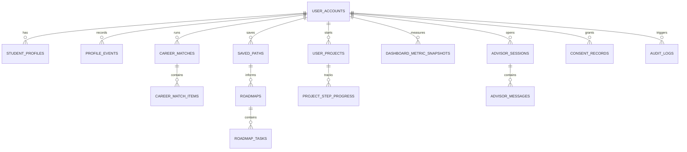

# DATA_SCHEMA_ZH

日期：2026-06-26

## 1. 文档目的

本文件定义 AI Student Growth Platform 第一版 MVP 的产品数据结构。

它回答的问题是：

> 用户填完 profile 之后，系统如何保存用户状态、career match 结果、roadmap、project progress、dashboard metrics、AI Advisor 对话、consent 和 audit logs？

本文件承接当前产品顺序：

```text
Student Profile -> Career Path Matcher -> Roadmap -> Project Builder -> Dashboard -> AI Advisor -> Basic RAG
```

注意：本文件定义的是产品运行时数据，不是 KB 内容结构。KB 内容结构已经由 `CONTENT_SCHEMA_ZH.md` 和 `kb/` 目录负责。

## 2. Non-goals

本文件暂不做以下事情：

- 不写最终 Supabase / Postgres migration SQL。
- 不设计完整学校端、家长端、雇主端 schema。
- 不设计完整申请追踪系统。
- 不设计完整 payment / subscription 数据结构。
- 不定义完整 RAG ingestion pipeline。
- 不保存敏感身份信息作为第一版必需字段。
- 不把 KB YAML 内容复制进用户表。

第一版目标是让 demo 和 MVP 闭环稳定运行：

1. 用户建立 profile。
2. 系统生成 3 个 career matches。
3. 用户保存一个 primary path。
4. 系统生成 4-week roadmap。
5. 用户开始一个 project / action。
6. Dashboard 根据真实状态更新。
7. AI Advisor 根据 profile、match、roadmap、project progress 回答。

## 3. 数据分层

### 3.1 Layer 1: KB 内容数据

位置：

```text
kb/
```

代表实体：

- `career_path.business_analyst`
- `career_path.data_analyst`
- `career_path.consultant`
- `project.vancouver_housing_dashboard`
- `action.define_project_question`
- `action.select_dataset`
- `metric.career_clarity`
- `metric.project_readiness`
- `metric.skill_readiness`

这些是产品内容资产。它们可以先保存在 YAML，后续再导入数据库或 CMS。

### 3.2 Layer 2: Product runtime data

位置：

```text
app database
```

代表实体：

- 用户账号。
- 学生 profile。
- Career match 运行结果。
- 保存的 career path。
- 用户自己的 roadmap。
- 用户自己的 project progress。
- Dashboard metric snapshots。
- AI Advisor session 和 message。
- Consent records。
- Audit logs。

本文件主要定义这一层。

### 3.3 Layer 3: AI / RAG data

代表实体：

- RAG chunks。
- Embeddings。
- Retrieval runs。
- Citation results。

Basic RAG 在 AI Advisor 基本跑通后接入。第一版产品表只需要为 Advisor message 留好 `sources_used` / `citation_refs` 字段，不需要一开始做完整 RAG 表。

## 4. 核心设计原则

### 4.1 KB ref 不复制

用户数据表只保存 KB ID，不复制 KB 全文。

示例：

```yaml
primary_path_id: career_path.business_analyst
recommended_project_id: project.vancouver_housing_dashboard
latest_action_id: action.define_project_question
metric_id: metric.career_clarity
```

这样做的好处：

- KB 内容可以独立更新。
- 用户历史结果可以保留当时的 decision snapshot。
- Product data 不会变成内容库副本。

### 4.2 重要 AI 结果要 snapshot

Career Match、Roadmap、Dashboard metric、Advisor message 都应该保存当时的输入摘要和版本号。

原因：

- 以后规则或 prompt 变了，旧结果仍可解释。
- 用户可以看到自己成长变化。
- 出现争议时可以追踪“当时系统为什么这么建议”。

### 4.3 Profile 是当前状态，event 是历史变化

`student_profiles` 保存用户当前 profile。

`profile_events` 保存重要变更历史。

不要每次用户改一个字段就复制一整份大 profile 到多个地方。Career Match 需要稳定性时，通过 `input_snapshot` 保存当时用到的 profile 摘要。

### 4.4 不按年级硬限制

产品支持：

- 高中生。
- 大学生。
- 新毕业生。
- early-career explorers。
- undecided users。

因此 schema 里可以有 `student_stage` 和 optional `grade_level`，但不能用 `grade_level` 作为核心必需字段。

### 4.5 隐私最小化

第一版不强制收集：

- 精确生日。
- 政府 ID。
- 家庭收入。
- 详细住址。
- 成绩单原件。
- 护照 / 学签文件。
- 医疗、心理、移民、法律敏感材料。

高中用户可能涉及未成年人。第一版可以先用 `age_band` 或 `student_stage` 做体验分层；如果正式面向未成年人上线，需要在法律审查后补 guardian / parental consent 规则。

### 4.6 AI Advisor 不是事实来源

AI Advisor 可以解释、总结、建议下一步，但不能覆盖结构化状态。

例如：

- 保存 primary path 必须写入 `saved_paths`。
- 完成 project step 必须写入 `project_step_progress`。
- Dashboard 分数必须写入 `dashboard_metric_snapshots`。

不要只把这些状态藏在聊天记录里。

## 5. MVP 实体总览

| 模块 | 主要写入表 | 主要读取表 |
| --- | --- | --- |
| Student Profile | `student_profiles`, `profile_events` | `user_accounts`, KB taxonomies |
| Career Path Matcher | `career_matches`, `career_match_items` | `student_profiles`, KB career paths, KB relations |
| Save Primary Path | `saved_paths` | `career_match_items`, KB career paths |
| Roadmap | `roadmaps`, `roadmap_tasks` | `student_profiles`, `saved_paths`, KB roadmaps, KB actions |
| Project Builder | `user_projects`, `project_step_progress` | KB projects, KB actions, `roadmap_tasks` |
| Dashboard | `dashboard_metric_snapshots` | `student_profiles`, `career_matches`, `roadmap_tasks`, `project_step_progress` |
| AI Advisor | `advisor_sessions`, `advisor_messages` | profile, match, roadmap, project, dashboard, KB refs |
| Consent | `consent_records` | `user_accounts` |
| Audit | `audit_logs` | all product tables |

## 6. Entity Relationship Map



## 7. ID 与命名规范

### 7.1 Product table ID

产品运行时数据使用 UUID：

```yaml
id: uuid
user_id: uuid
student_profile_id: uuid
career_match_id: uuid
roadmap_id: uuid
user_project_id: uuid
```

### 7.2 KB ref ID

KB 引用保留字符串 ID：

```yaml
path_id: career_path.business_analyst
project_template_id: project.vancouver_housing_dashboard
action_id: action.define_project_question
metric_id: metric.career_clarity
source_id: source.statcan_open_license
```

V1 可以直接存 string。后续如果把 KB 导入数据库，可以再加 FK 或校验表。

### 7.3 Timestamp

所有核心表至少包含：

```yaml
created_at:
updated_at:
```

结果类或事件类表可以只包含：

```yaml
created_at:
```

例如 `career_match_items`、`advisor_messages`、`audit_logs` 通常不需要频繁 update。

### 7.4 Soft delete

用户可见状态建议用：

```yaml
status: active | archived | deleted
```

第一版不建议物理删除重要决策记录。真正的账号删除 / 数据删除需要单独流程，不能用普通 archive 代替。

## 8. Enums

### 8.1 student_type

```yaml
high_school_student
university_student
recent_graduate
early_career
other
unknown
```

### 8.2 student_stage

对齐 `kb/taxonomies.yaml`：

```yaml
high_school_explorer
university_beginner
university_mid
university_job_search
recent_graduate
early_career
explorer_unknown
```

### 8.3 path_status

```yaml
exploring
primary
archived
```

### 8.4 roadmap_status

```yaml
draft
active
completed
paused
archived
```

### 8.5 task_status

```yaml
not_started
in_progress
done
blocked
need_help
skipped
```

### 8.6 project_status

```yaml
not_started
in_progress
completed
paused
archived
```

### 8.7 advisor_message_role

```yaml
system
user
assistant
tool
```

### 8.8 risk_level

```yaml
low
medium
high
blocked
```

`blocked` 表示系统不应该直接回答，需要转为安全提示、边界说明或人工/外部专业资源建议。

## 9. Core Tables

## 9.1 `user_accounts`

### 目的

保存产品用户账号的轻量信息。认证本身可以由 Supabase Auth 或其他 auth provider 管理。

### 写入时机

用户第一次注册或匿名 demo session 创建时。

### 字段

| 字段 | 类型 | 必需 | 说明 |
| --- | --- | --- | --- |
| `id` | uuid | yes | 产品用户 ID |
| `auth_user_id` | uuid / string | no | 外部 auth provider 用户 ID |
| `email` | string | no | 登录邮箱；demo 可为空 |
| `display_name` | string | no | 展示名 |
| `locale` | string | yes | 默认 `en-CA` 或 `zh-CN` |
| `country` | string | yes | MVP 默认 `Canada` |
| `timezone` | string | no | 用户时区 |
| `account_type` | enum | yes | `student`, `demo`, `admin` |
| `status` | enum | yes | `active`, `archived`, `deleted` |
| `created_at` | timestamp | yes | 创建时间 |
| `updated_at` | timestamp | yes | 更新时间 |

### V1 备注

- 不要在这里保存学生详细背景。
- 不要把 consent 状态只放在这里；consent 要有独立记录。

## 9.2 `student_profiles`

### 目的

保存用户当前职业规划 profile。Career Matcher、Roadmap、Dashboard、AI Advisor 都从这里读取当前状态。

### 写入时机

- Onboarding 完成。
- 用户修改兴趣、技能、目标、项目经历。
- Advisor 或 Dashboard 引导用户补充信息后，用户确认更新。

### 字段

| 字段 | 类型 | 必需 | 说明 |
| --- | --- | --- | --- |
| `id` | uuid | yes | Profile ID |
| `user_id` | uuid | yes | 所属用户 |
| `profile_version` | int | yes | 每次重要更新递增 |
| `completed_profile` | boolean | yes | 是否完成 MVP onboarding |
| `student_type` | enum | yes | 见 `student_type` |
| `student_stage` | enum | yes | 见 `student_stage` |
| `age_band` | string | no | 例如 `under_18`, `18_plus`, `unknown` |
| `country` | string | yes | MVP 默认 `Canada` |
| `province` | string | no | `BC`, `ON`, `all`, `unknown` |
| `school` | string | no | 学校名称，可为空 |
| `grade_level` | string | no | optional，不作为硬限制 |
| `major` | string | no | 当前专业 |
| `target_majors` | jsonb | no | 目标专业列表 |
| `liked_subjects` | jsonb | no | 喜欢的科目 / 主题 |
| `disliked_subjects` | jsonb | no | 不喜欢的科目 / 主题 |
| `interested_industries` | jsonb | no | 感兴趣行业 |
| `preferred_work_styles` | jsonb | no | 工作风格偏好 |
| `skills` | jsonb | no | 技能 level map |
| `projects` | jsonb | no | 用户已有项目摘要 |
| `internships` | jsonb | no | 用户已有实习摘要 |
| `extracurriculars` | jsonb | no | 课外活动摘要 |
| `short_term_goal` | text | no | 近期目标 |
| `long_term_goal` | text | no | 长期目标 |
| `main_question` | text | yes | 当前最想解决的问题 |
| `weekly_time_commitment_hours` | number | no | 每周可投入小时数 |
| `profile_summary` | text | no | 系统生成、用户可见的 summary |
| `profile_summary_version` | string | no | summary prompt / rules 版本 |
| `data_quality_flags` | jsonb | no | 缺失字段、冲突字段、不确定性 |
| `status` | enum | yes | `active`, `archived`, `deleted` |
| `created_at` | timestamp | yes | 创建时间 |
| `updated_at` | timestamp | yes | 更新时间 |

### 示例

```yaml
id: uuid
user_id: uuid
profile_version: 1
completed_profile: true
student_type: university_student
student_stage: university_beginner
age_band: 18_plus
country: Canada
province: all
school: Canadian university
major: Economics
target_majors: []
liked_subjects:
  - economics
  - business
  - market analysis
disliked_subjects:
  - pure coding
interested_industries:
  - data
  - business
  - consulting
skills:
  excel: beginner
  sql: none
  python: none
  presentation: beginner
  writing: intermediate
projects: []
internships: []
short_term_goal: Find a clearer internship direction before second year.
long_term_goal: Work in a business or data-related role.
weekly_time_commitment_hours: 5
main_question: I do not know whether I should explore data analyst, business analyst, or consulting.
```

## 9.3 `profile_events`

### 目的

保存 profile 的重要变更历史，用于 audit、dashboard trend、AI Advisor 上下文。

### 字段

| 字段 | 类型 | 必需 | 说明 |
| --- | --- | --- | --- |
| `id` | uuid | yes | Event ID |
| `user_id` | uuid | yes | 所属用户 |
| `student_profile_id` | uuid | yes | Profile ID |
| `event_type` | enum | yes | `created`, `updated`, `summary_generated`, `field_confirmed` |
| `changed_fields` | jsonb | no | 变更字段名列表 |
| `before_snapshot_redacted` | jsonb | no | 敏感信息脱敏后的旧值 |
| `after_snapshot_redacted` | jsonb | no | 敏感信息脱敏后的新值 |
| `source` | enum | yes | `onboarding`, `user_edit`, `advisor_prompt`, `admin` |
| `created_at` | timestamp | yes | 事件时间 |

### V1 备注

第一版可以只记录：

- profile created。
- profile updated。
- profile summary generated。

不要把完整敏感 profile 每次都原样塞进 event。

## 9.4 `career_matches`

### 目的

保存一次 Career Matcher 运行。它是一次推荐 run，不是单个推荐 path。

### 写入时机

用户点击 `Show my career matches` 或重新生成 match。

### 字段

| 字段 | 类型 | 必需 | 说明 |
| --- | --- | --- | --- |
| `id` | uuid | yes | Match run ID |
| `user_id` | uuid | yes | 所属用户 |
| `student_profile_id` | uuid | yes | 使用的 profile |
| `profile_version` | int | yes | 运行时的 profile version |
| `matcher_version` | string | yes | 例如 `career_matcher_v1_rules_2026_06_26` |
| `kb_version` | string | no | KB 内容版本 |
| `input_snapshot` | jsonb | yes | 运行时 profile 摘要 |
| `candidate_path_ids` | jsonb | yes | 本次参与排序的 path ids |
| `status` | enum | yes | `completed`, `partial`, `failed` |
| `uncertainty` | jsonb | no | 缺失信息、不确定性 |
| `created_at` | timestamp | yes | 创建时间 |

### V1 备注

Career match result 应该尽量不可变。如果用户修改 profile 后重新生成，创建新的 `career_matches`。

## 9.5 `career_match_items`

### 目的

保存一次 match run 里的单条职业路径推荐。

### 字段

| 字段 | 类型 | 必需 | 说明 |
| --- | --- | --- | --- |
| `id` | uuid | yes | Match item ID |
| `career_match_id` | uuid | yes | 所属 match run |
| `user_id` | uuid | yes | 冗余 user id，便于 RLS |
| `path_id` | string | yes | KB career path ID |
| `rank` | int | yes | 排名 |
| `fit_score` | number | yes | 0-100 |
| `fit_label` | string | yes | 例如 `Worth exploring` |
| `score_breakdown` | jsonb | yes | 分维度分数 |
| `fit_reason` | text | yes | 推荐原因 |
| `main_gap` | text | yes | 主要缺口 |
| `first_action_id` | string | no | KB action ID |
| `recommended_project_id` | string | no | KB project ID |
| `uncertainty` | jsonb | no | 推荐不确定性 |
| `risk_notes` | jsonb | no | 安全表达、边界说明 |
| `created_at` | timestamp | yes | 创建时间 |

### 示例

```yaml
path_id: career_path.business_analyst
rank: 1
fit_score: 82
fit_label: Worth exploring
score_breakdown:
  interest: 22
  skill: 12
  academic: 13
  evidence: 4
  goal: 14
  time: 8
fit_reason: Your Economics background, business interest, and dislike of pure coding make Business Analyst a practical first path to test.
main_gap: You need project evidence that shows structured analysis and communication.
first_action_id: action.define_project_question
recommended_project_id: project.vancouver_housing_dashboard
uncertainty:
  missing_inputs:
    - preferred_work_styles
    - extracurriculars
```

## 9.6 `saved_paths`

### 目的

保存用户主动选择、收藏或设为 primary 的 career path。

### 写入时机

用户在 Career Match Results 选择一个方向。

### 字段

| 字段 | 类型 | 必需 | 说明 |
| --- | --- | --- | --- |
| `id` | uuid | yes | Saved path ID |
| `user_id` | uuid | yes | 所属用户 |
| `path_id` | string | yes | KB career path ID |
| `status` | enum | yes | `exploring`, `primary`, `archived` |
| `source_career_match_id` | uuid | no | 来源 match run |
| `source_match_item_id` | uuid | no | 来源 match item |
| `saved_reason` | text | no | 用户选择原因 |
| `created_at` | timestamp | yes | 创建时间 |
| `updated_at` | timestamp | yes | 更新时间 |

### 规则

- 一个用户同一时间最多只有一个 `status: primary` path。
- 用户可以有多个 `exploring` paths。
- 用户切换 primary path 时，不删除旧 path，改成 `archived` 或 `exploring`。

## 9.7 `roadmaps`

### 目的

保存用户自己的 roadmap。Roadmap 是根据 profile、primary path、KB roadmap template 和当前项目状态生成的用户计划。

### 写入时机

用户保存 primary path 后，系统生成 4-week roadmap。

### 字段

| 字段 | 类型 | 必需 | 说明 |
| --- | --- | --- | --- |
| `id` | uuid | yes | Roadmap ID |
| `user_id` | uuid | yes | 所属用户 |
| `student_profile_id` | uuid | yes | 使用的 profile |
| `saved_path_id` | uuid | no | 用户保存的 path |
| `primary_path_id` | string | yes | KB career path ID |
| `roadmap_template_id` | string | no | KB roadmap template ID |
| `generator_version` | string | yes | Roadmap generator 版本 |
| `title` | string | yes | 展示标题 |
| `time_horizon_weeks` | int | yes | MVP 默认 4 |
| `weekly_time_commitment_hours` | number | no | 生成时采用的每周时间 |
| `assumptions` | jsonb | no | 生成时假设 |
| `status` | enum | yes | 见 `roadmap_status` |
| `created_at` | timestamp | yes | 创建时间 |
| `updated_at` | timestamp | yes | 更新时间 |

### V1 备注

Roadmap 可以重新生成，但旧 roadmap 不应直接覆盖。建议旧 roadmap 设为 `archived`，新 roadmap 设为 `active`。

## 9.8 `roadmap_tasks`

### 目的

保存 roadmap 里的每个具体 task / action。

### 字段

| 字段 | 类型 | 必需 | 说明 |
| --- | --- | --- | --- |
| `id` | uuid | yes | Task ID |
| `roadmap_id` | uuid | yes | 所属 roadmap |
| `user_id` | uuid | yes | 冗余 user id |
| `week_index` | int | yes | 第几周，从 1 开始 |
| `position_index` | int | yes | 周内排序 |
| `action_id` | string | no | KB action ID |
| `related_project_id` | uuid | no | 用户项目 ID |
| `related_project_template_id` | string | no | KB project template ID |
| `title` | string | yes | 展示标题 |
| `description` | text | no | 展示描述 |
| `expected_output_type` | string | no | `text`, `link`, `file`, `checklist` |
| `status` | enum | yes | 见 `task_status` |
| `due_at` | timestamp | no | 截止时间 |
| `started_at` | timestamp | no | 开始时间 |
| `completed_at` | timestamp | no | 完成时间 |
| `metric_ids` | jsonb | no | 影响的 metric IDs |
| `created_at` | timestamp | yes | 创建时间 |
| `updated_at` | timestamp | yes | 更新时间 |

### 示例

```yaml
week_index: 1
position_index: 1
action_id: action.define_project_question
title: Define a project research question
expected_output_type: text
status: in_progress
metric_ids:
  - metric.career_clarity
  - metric.project_readiness
```

## 9.9 `user_projects`

### 目的

保存用户从 Project Builder 里开始的项目实例。

### 写入时机

用户选择一个 project template 并点击开始。

### 字段

| 字段 | 类型 | 必需 | 说明 |
| --- | --- | --- | --- |
| `id` | uuid | yes | User project ID |
| `user_id` | uuid | yes | 所属用户 |
| `project_template_id` | string | yes | KB project ID |
| `primary_path_id` | string | no | 关联 career path ID |
| `source_roadmap_id` | uuid | no | 来源 roadmap |
| `source_task_id` | uuid | no | 来源 roadmap task |
| `title` | string | yes | 用户项目标题，默认来自 KB |
| `selected_reason` | text | no | 为什么选择这个项目 |
| `status` | enum | yes | 见 `project_status` |
| `current_step_number` | int | no | 当前步骤 |
| `started_at` | timestamp | no | 开始时间 |
| `completed_at` | timestamp | no | 完成时间 |
| `created_at` | timestamp | yes | 创建时间 |
| `updated_at` | timestamp | yes | 更新时间 |

### V1 备注

`user_projects` 是用户实例，不是 KB template。KB template 更新不应该自动改写用户已开始项目的历史步骤。

## 9.10 `project_step_progress`

### 目的

保存用户在一个项目里的每一步进度和提交内容。

### 字段

| 字段 | 类型 | 必需 | 说明 |
| --- | --- | --- | --- |
| `id` | uuid | yes | Step progress ID |
| `user_project_id` | uuid | yes | 所属用户项目 |
| `user_id` | uuid | yes | 冗余 user id |
| `step_number` | int | yes | 第几步 |
| `action_id` | string | no | KB action ID |
| `title` | string | yes | 步骤标题 |
| `status` | enum | yes | 见 `task_status` |
| `submission_type` | string | no | `text`, `link`, `file`, `checklist` |
| `submission_text` | text | no | 用户提交文本 |
| `source_url` | string | no | 用户提交链接 |
| `file_id` | uuid | no | 未来上传文件 ID |
| `ai_feedback` | text | no | AI 反馈摘要 |
| `rubric_scores` | jsonb | no | rubric 评分 |
| `review_status` | enum | no | `not_reviewed`, `ai_reviewed`, `user_revised` |
| `started_at` | timestamp | no | 开始时间 |
| `completed_at` | timestamp | no | 完成时间 |
| `created_at` | timestamp | yes | 创建时间 |
| `updated_at` | timestamp | yes | 更新时间 |

### 示例

```yaml
user_project_id: uuid
step_number: 1
action_id: action.define_project_question
title: Define a project research question
status: done
submission_type: text
submission_text: How do housing prices differ across Vancouver neighbourhoods, and what factors may explain the difference?
rubric_scores:
  clarity: 4
  scope: 3
  feasibility: 4
review_status: ai_reviewed
```

## 9.11 `dashboard_metric_snapshots`

### 目的

保存 dashboard 每次计算出来的指标结果。

Dashboard 不应该只显示静态百分比。它应该根据用户真实状态计算，例如：

- Profile 完整度。
- Career clarity。
- Project readiness。
- Skill readiness。
- Interview readiness。

### 写入时机

- 用户完成 profile。
- Career match 生成。
- 用户保存 primary path。
- Roadmap 生成。
- 用户完成 task / project step。
- Advisor 帮用户确认下一步后触发重新计算。

### 字段

| 字段 | 类型 | 必需 | 说明 |
| --- | --- | --- | --- |
| `id` | uuid | yes | Snapshot ID |
| `user_id` | uuid | yes | 所属用户 |
| `metric_id` | string | yes | KB metric ID |
| `score` | number | yes | 0-100 |
| `score_label` | string | no | 展示 label |
| `reason` | text | no | 分数解释 |
| `input_signals` | jsonb | yes | 本次计算用到的信号 |
| `computation_version` | string | yes | 计算规则版本 |
| `related_entity_type` | string | no | `profile`, `roadmap`, `project`, `match` |
| `related_entity_id` | uuid | no | 关联实体 ID |
| `created_at` | timestamp | yes | 计算时间 |

### 示例

```yaml
metric_id: metric.project_readiness
score: 35
score_label: Started
reason: You have selected a beginner project and completed the first planning step, but you have not produced a dataset analysis or dashboard yet.
input_signals:
  selected_project: true
  completed_project_steps: 1
  has_final_artifact: false
computation_version: dashboard_metrics_v1
```

### V1 读取规则

Dashboard 默认读取每个 `metric_id` 最新一条 snapshot。

如果要显示趋势，则读取同一 `metric_id` 的历史 snapshots。

## 9.12 `advisor_sessions`

### 目的

保存一次 AI Advisor 对话 session。

Advisor 应该读取结构化状态，而不是要求用户重复输入全部背景。

### 写入时机

用户打开 AI Advisor。

### 字段

| 字段 | 类型 | 必需 | 说明 |
| --- | --- | --- | --- |
| `id` | uuid | yes | Session ID |
| `user_id` | uuid | yes | 所属用户 |
| `student_profile_id` | uuid | no | 当前 profile |
| `active_roadmap_id` | uuid | no | 当前 roadmap |
| `active_user_project_id` | uuid | no | 当前 project |
| `context_snapshot` | jsonb | yes | 打开 session 时的上下文摘要 |
| `advisor_version` | string | yes | Prompt / policy 版本 |
| `status` | enum | yes | `active`, `closed`, `archived` |
| `created_at` | timestamp | yes | 创建时间 |
| `updated_at` | timestamp | yes | 更新时间 |

### context_snapshot 最小内容

```yaml
profile_summary:
saved_primary_path:
latest_match_summary:
current_roadmap:
current_project_progress:
dashboard_metrics:
```

## 9.13 `advisor_messages`

### 目的

保存 AI Advisor 的消息记录。

### 字段

| 字段 | 类型 | 必需 | 说明 |
| --- | --- | --- | --- |
| `id` | uuid | yes | Message ID |
| `advisor_session_id` | uuid | yes | 所属 session |
| `user_id` | uuid | yes | 冗余 user id |
| `role` | enum | yes | `system`, `user`, `assistant`, `tool` |
| `content` | text | yes | 消息内容 |
| `intent` | string | no | 例如 `ask_next_step`, `explain_match`, `project_feedback` |
| `risk_level` | enum | yes | 见 `risk_level` |
| `sources_used` | jsonb | no | KB source IDs 或 RAG citation refs |
| `structured_refs` | jsonb | no | 相关 path / project / action / metric refs |
| `recommended_next_action_id` | string | no | KB action ID |
| `related_path_id` | string | no | KB career path ID |
| `related_project_id` | uuid | no | 用户项目 ID |
| `related_project_template_id` | string | no | KB project ID |
| `created_at` | timestamp | yes | 创建时间 |

### 示例

```yaml
role: assistant
intent: ask_next_step
risk_level: low
content: Your next useful move is to finish the project question before picking tools. Keep it narrow enough that you can answer it with one public dataset.
structured_refs:
  action_ids:
    - action.define_project_question
  metric_ids:
    - metric.project_readiness
recommended_next_action_id: action.define_project_question
sources_used: []
```

### V1 安全规则

Advisor message 不应该：

- 承诺录取、offer、薪资或签证结果。
- 提供法律、移民、医疗、心理治疗建议。
- 用羞辱或焦虑语言推动用户。
- 把用户说成“不适合某职业”。

高风险内容应标记 `risk_level: high` 或 `blocked`，并使用安全替代表达。

## 9.14 `consent_records`

### 目的

保存用户同意记录。Consent 不应该只是一个 boolean，因为条款版本会变化，用户也可能撤回。

### 写入时机

- 用户创建账号。
- 用户开始 profile personalization。
- 用户使用 AI Advisor。
- 用户上传 resume / file。
- 用户同意 marketing 通知。
- 用户撤回同意。

### 字段

| 字段 | 类型 | 必需 | 说明 |
| --- | --- | --- | --- |
| `id` | uuid | yes | Consent record ID |
| `user_id` | uuid | yes | 所属用户 |
| `consent_type` | enum | yes | 见下方 |
| `policy_version` | string | yes | 对应条款版本 |
| `accepted` | boolean | yes | 是否同意 |
| `accepted_at` | timestamp | no | 同意时间 |
| `withdrawn_at` | timestamp | no | 撤回时间 |
| `source` | enum | no | `signup`, `onboarding`, `advisor`, `settings` |
| `metadata` | jsonb | no | 设备、地区、UI variant 等非敏感信息 |
| `created_at` | timestamp | yes | 创建时间 |

### consent_type

```yaml
terms_of_service
privacy_policy
profile_personalization
ai_advisor
user_uploaded_files
marketing_communications
guardian_or_parental_consent
```

### V1 备注

- `guardian_or_parental_consent` 是否启用取决于正式上线地区、年龄范围和法律审查。
- Demo 阶段可以保留字段，不一定启用完整流程。
- Consent 变更必须写入 `audit_logs`。

## 9.15 `audit_logs`

### 目的

保存重要系统行为记录，用于 debug、合规、信任与用户数据安全。

### 写入时机

重要状态变化时写入，例如：

- Profile created / updated。
- Career match generated。
- Primary path saved / changed。
- Roadmap generated。
- Task status changed。
- Project step submitted。
- Advisor high-risk response blocked。
- Consent accepted / withdrawn。
- Data export requested。
- Account deletion requested。

### 字段

| 字段 | 类型 | 必需 | 说明 |
| --- | --- | --- | --- |
| `id` | uuid | yes | Audit log ID |
| `actor_user_id` | uuid | no | 触发用户；系统任务可为空 |
| `actor_type` | enum | yes | `user`, `system`, `admin` |
| `action` | string | yes | 行为名 |
| `entity_type` | string | yes | 被影响实体类型 |
| `entity_id` | uuid / string | no | 被影响实体 ID |
| `request_id` | string | no | 请求追踪 ID |
| `before_snapshot_redacted` | jsonb | no | 脱敏旧值 |
| `after_snapshot_redacted` | jsonb | no | 脱敏新值 |
| `metadata` | jsonb | no | 额外非敏感信息 |
| `created_at` | timestamp | yes | 事件时间 |

### V1 备注

- Audit log 不应该存完整聊天内容或完整敏感 profile。
- 需要时存 message id / profile id，而不是复制全文。
- Admin 操作必须有 actor 和 action。

## 10. Optional / Later Tables

这些表不是第一版 demo 必需，但 schema 应提前留位置。

### 10.1 `user_uploaded_files`

用于 resume、transcript、portfolio 文件上传。

V1 不建议一开始做，因为会带来隐私、存储、安全和解析复杂度。

未来字段：

```yaml
id:
user_id:
file_type:
storage_path:
original_filename:
mime_type:
size_bytes:
extracted_text_status:
consent_record_id:
created_at:
deleted_at:
```

### 10.2 `rag_retrieval_runs`

用于记录 AI Advisor 每次检索了哪些 chunks。

Basic RAG 接入后再做。

未来字段：

```yaml
id:
user_id:
advisor_message_id:
query:
retrieved_chunk_ids:
source_ids:
retrieval_version:
created_at:
```

### 10.3 `user_goal_events`

用于更细地追踪用户目标变化。

第一版可以先放在 `profile_events`。

### 10.4 `applications`

用于大学申请、实习申请、项目申请追踪。

第一版不要做，避免产品从 career planning MVP 变成大型申请管理平台。

## 11. Module Data Flow

### 11.1 Student Profile flow

```text
User submits onboarding
  -> upsert student_profiles
  -> insert profile_events
  -> insert audit_logs
  -> compute metric.career_clarity snapshot
```

### 11.2 Career Matcher flow

```text
User clicks "Show my career matches"
  -> read student_profiles
  -> read KB career paths and relations
  -> insert career_matches
  -> insert career_match_items x 3
  -> insert audit_logs
```

### 11.3 Save Primary Path flow

```text
User chooses one path
  -> insert or update saved_paths
  -> archive previous primary path if needed
  -> insert audit_logs
  -> compute metric.career_clarity snapshot
```

### 11.4 Roadmap flow

```text
Primary path saved
  -> read student_profiles
  -> read saved_paths
  -> read KB roadmap/actions/projects
  -> insert roadmaps
  -> insert roadmap_tasks
  -> insert audit_logs
```

### 11.5 Project Builder flow

```text
User starts project
  -> insert user_projects
  -> optionally connect roadmap_tasks
  -> insert or update project_step_progress
  -> compute metric.project_readiness snapshot
```

### 11.6 Dashboard flow

```text
Any meaningful state change
  -> read latest profile/match/roadmap/project states
  -> compute relevant metric snapshots
  -> dashboard reads latest snapshot per metric_id
```

### 11.7 AI Advisor flow

```text
User opens advisor
  -> create advisor_sessions with context_snapshot
User sends message
  -> insert advisor_messages role=user
System replies
  -> read structured state and optional KB/RAG refs
  -> insert advisor_messages role=assistant
  -> if action suggested, include recommended_next_action_id
```

## 12. MVP Required Tables

第一版真正需要建的表：

1. `user_accounts`
2. `student_profiles`
3. `profile_events`
4. `career_matches`
5. `career_match_items`
6. `saved_paths`
7. `roadmaps`
8. `roadmap_tasks`
9. `user_projects`
10. `project_step_progress`
11. `dashboard_metric_snapshots`
12. `advisor_sessions`
13. `advisor_messages`
14. `consent_records`
15. `audit_logs`

可以暂缓：

- `user_uploaded_files`
- `rag_retrieval_runs`
- `applications`
- institution / parent / admin workspace tables

## 13. API Shape Draft

这不是最终 API，只是帮助后续实现对齐。

### 13.1 Profile

```text
POST /api/profile
GET  /api/profile/me
PATCH /api/profile/me
```

写入：

- `student_profiles`
- `profile_events`
- `audit_logs`

### 13.2 Career Match

```text
POST /api/career-matches
GET  /api/career-matches/latest
```

写入：

- `career_matches`
- `career_match_items`
- `audit_logs`

### 13.3 Saved Path

```text
POST /api/saved-paths
PATCH /api/saved-paths/:id
```

写入：

- `saved_paths`
- `audit_logs`

### 13.4 Roadmap

```text
POST /api/roadmaps
GET  /api/roadmaps/active
PATCH /api/roadmap-tasks/:id
```

写入：

- `roadmaps`
- `roadmap_tasks`
- `audit_logs`

### 13.5 Project

```text
POST /api/projects
GET  /api/projects/active
PATCH /api/project-steps/:id
```

写入：

- `user_projects`
- `project_step_progress`
- `dashboard_metric_snapshots`
- `audit_logs`

### 13.6 Dashboard

```text
GET /api/dashboard
POST /api/dashboard/recompute
```

写入：

- `dashboard_metric_snapshots`

### 13.7 Advisor

```text
POST /api/advisor/sessions
POST /api/advisor/messages
GET  /api/advisor/sessions/:id/messages
```

写入：

- `advisor_sessions`
- `advisor_messages`
- `audit_logs` for high-risk or blocked events

## 14. Security / Privacy Requirements

### 14.1 Row Level Security

所有用户数据表必须按 `user_id` 做隔离。

用户只能读取自己的：

- Profile
- Match results
- Saved paths
- Roadmaps
- Projects
- Dashboard metrics
- Advisor messages
- Consent records

Admin 访问必须单独授权并写 audit log。

### 14.2 Sensitive fields

以下内容不进入 V1 required schema：

- 精确生日。
- 家庭住址。
- 政府 ID。
- 完整成绩单。
- 护照 / 签证文件。
- 医疗 / 心理健康细节。
- 家庭财务信息。

如果未来要支持文件上传或 resume parsing，必须先补：

- explicit consent。
- file deletion。
- retention policy。
- extraction audit。
- access control。

### 14.3 Data deletion

需要区分：

- `archived`: 用户不想再看到，但数据仍用于历史。
- `deleted`: 用户请求删除，进入数据删除流程。
- physical deletion: 根据 retention policy 执行。

第一版可以先实现 archive，但产品设计上要预留正式删除请求入口。

### 14.4 AI safety

AI Advisor 输出必须能关联：

- prompt / advisor version。
- context snapshot。
- sources used。
- risk level。
- structured refs。

高风险或 blocked 输出要写入 audit log。

## 15. Demo Readiness Checklist

Demo 数据结构通过的标准：

- 可以保存 Demo User A / Demo User B 的 profile。
- 可以用同一个 schema 支持高中生、大学生、新毕业生和 early-career explorer。
- 不依赖 `grade_level` 才能运行 matcher。
- 可以保存 3 个 career match items。
- 可以把一个 path 设为 primary。
- 可以生成 4-week roadmap 和多个 tasks。
- 可以把 `project.vancouver_housing_dashboard` 实例化为用户项目。
- 可以保存 `action.define_project_question` 的完成结果。
- Dashboard 可以读取真实状态并生成 metric snapshots。
- Advisor 可以从结构化状态生成上下文，而不是要求用户重新描述。
- Consent 和 audit log 可以记录关键行为。

## 16. Open Decisions

第一版实现前还需要确认：

1. 是否使用 Supabase Auth 作为 `auth_user_id` 来源。
2. 是否允许匿名 demo user，不登录也能跑完整 demo。
3. `profile_summary` 是实时生成，还是保存后只在 profile 更新时刷新。
4. Dashboard metric 是每次事件后自动 recompute，还是用户打开 dashboard 时 lazy recompute。
5. AI Advisor message 是否默认保存完整内容，以及 retention 时间。
6. 高中用户正式上线前是否启用 guardian / parental consent。
7. KB YAML 是运行时直接读取，还是 build/import 到数据库。

## 17. Next Recommended Step

完成本文件后，下一步建议做：

> `ONBOARDING_FLOW_ZH.md`

原因：

- Data schema 已经定义 profile 需要哪些字段。
- 但前端不应该把所有字段一次性问完。
- Onboarding flow 需要决定哪些字段是首屏必问、哪些是 progressive profile、哪些由 AI Advisor 后续补问。

之后再进入：

1. `APP_DATA_MODEL_SQL_DRAFT.sql`
2. API route draft
3. Frontend MVP scaffold
